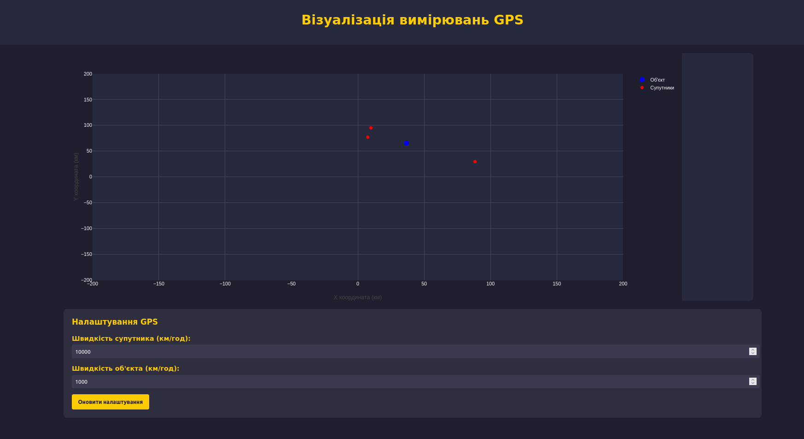

# lab_5

Основні функції сторінки:

1. Сторінка містить графік, який оновлюється в режимі реального часу, відображаючи позиції об'єкта та супутників на двовимірній площині.

2. Встановлюється з'єднання з WebSocket-сервером (ws://localhost:4001) для отримання даних GPS від супутників. При надходженні нових даних вони обробляються для розрахунку позиції об'єкта за допомогою трілатерації, використовуючи відстані до щонайменше трьох супутників.

3. Отримані дані супутників використовуються для обчислення позиції об'єкта. На графіку відображаються актуальні позиції як супутників, так і об'єкта, причому позиція об'єкта оновлюється відповідно до розрахунків.
   
4. Сторінка містить форму, яка дозволяє користувачу змінювати налаштування GPS-системи, такі як швидкість супутників та швидкість об'єкта. При натисканні кнопки "Оновити налаштування" дані з форми відправляються на сервер через HTTP-запит (POST на http://localhost:4001/config) для оновлення параметрів GPS-системи.
